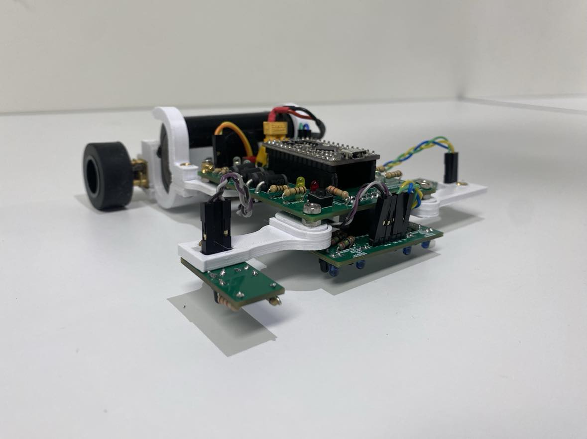

# Josh Roe

### Title: Mechatronics Engineer, Developer
### Contact: joshroe2001@gmail.com

## About Me:
Hello, my name is Josh, and I am a passionate undergrad Mechatronics Engineer with a strong interest in robotics, specifically autonomous robots/vehicles. I am currently working towards a Bachelor of Engineering (Honours majoring in Mechatronics) and a Bachelor of Information Technology (majoring in Computer Science). During my time at Uni I have developed a solid foundation in both theoretical and practical aspects of engineering. My journey so far has been marked by a curious and innovative spirit, leading me to work on diverse projects ranging from computer vision robotic systems, custom ESP32 Dev boards to high-speed custom 3D Printers.

I thrive on challenges and enjoy the process of conceptualising, designing, and implementing solutions that push the boundaries of technology i have available to me and my own creativity. This GitHub portfolio showcases a selection of my projects, reflecting my skills in areas such as CAD design, programming in various languages, and the outcomes of my abilities in programs such as KiCAD and Fusion360.

Feel free to explore my work, and don’t hesitate to reach out for collaborations or discussions!

#Projects

## Custom ESP32 Dev Board

[Custom ESP32 Dev Board](Custom_ESP32_Dev_Board/)

## PID Line Follower

[PID Line Follower](Line_Following_Robot/)

## Computer Vision Lunar Rover

[Computer Vision Lunar Rover](Computer_Vision_Lunar_Rover/)

## Custom 3D Printer

[Custom 3D Printer](Custom_3D_Printer/)

## One Wheeled Electric Skateboard

[One Wheeled Electric Skateboard](Self_Balancing_Electric_Skateboard/)

## Drones

[Drones](Drones/)

