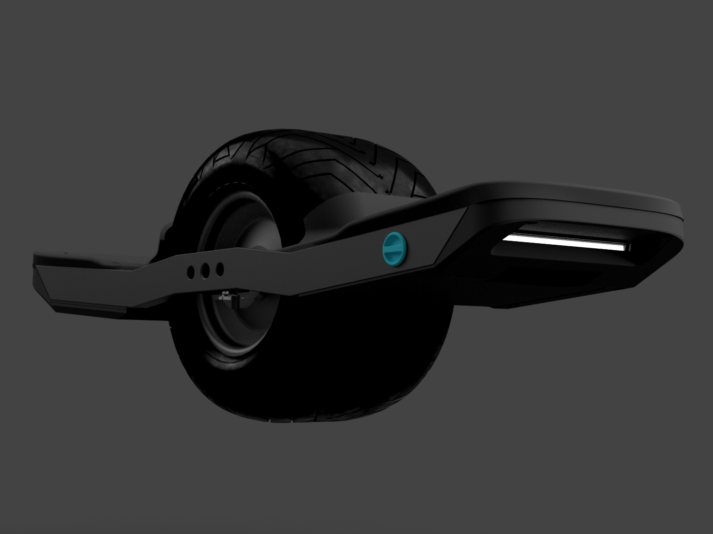

# Self Balancing VESC Based One-Wheel

## Introduction
As a personal project I have been developing my own custom self balancing electric skateboard. This is heavily inspired by the Future motion Onewheel but with more range, top speed, repairability and customisation. This is a project that I have been working on for over 3 years with multiple versions made, now I have landed on what I think is the perfect design. I am in the process of constructing my most recent design and should be finished the build by mid August.

## Design Highlights:

### Performance: 
Theoretical top speed of 40+ km/h
### Battery: 
Utilising 40x21700 Samsung 50s 5000mAh Li-Ion cells. Theoretical range of roughly 40km
### Construction: 
The main construction of the board is using CNC aluminium rails with an aluminium battery box lid and bot aluminium and Polycarbonate lids for the controller box. The Construction of the box 3D printed using PAHT-CF filament and attached to the lids with a number of machine screws and threaded inserts. 

## Images
### Most recent version

Full Board construction

18S 2p Battery pack with LEDs and BMS

Controller box with Polycarbonate top lid and Aluminium bottom lid/heatsink, 2S2p boost battery pack

### First working prototype

